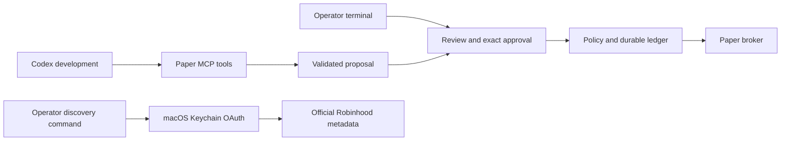

# Architecture and boundaries

The agent creates proposals; deterministic code decides whether they are valid. The operator approves the exact proposal. The broker adapter alone submits. In this release, that adapter is a local simulator and cannot contact Robinhood.

## Modules

- `models` and `policy`: strict values, canonical hashes, account/instrument allowlists, freshness, buying power and pending exposure.
- `state` and `execution`: SQLite with full synchronization, transaction-before-submit, nonblocking process lock, approvals, events, uncertainty and recovery.
- `paper` and `replay`: persistent fake account, next-tick matching, shared tick liquidity, partial fills, fees, slippage and weekday T+1 cash availability.
- `connection` and `guard`: official SDK OAuth with PKCE and issuer validation, loopback callback, Keychain-only storage, exact destination checks, bounded discovery and reviewed public-market tool schemas.
- `server` and `cli`: paper-only agent surface and separate interactive operator actions.

## Guarantees within the implemented boundary

Normal execution cannot submit without a fresh exact approval, exceed configured limits, silently change broker mode, or retry a lost submission response. Pending approvals are cleared when a new executor starts. An ambiguous result retains exposure reservations and halts submissions. Unresolved orders prevent resume. Cancellation can race a fill; it does not reverse that fill.

Daily value limits count the full submitted notional, including orders later canceled or rejected. This is deliberately conservative. Dates use UTC. Reserve cash includes a configured fee allowance; paper costs must fit that allowance. The paper matching model may differ substantially from an exchange.

The SQLite backup command produces a consistent local snapshot. All application state is local, not a distributed service. There is one executor lock per ledger. Use one canonical ledger path for a paper account.

## Limits

All code runs as the same macOS user by the owner's choice. That user can change files, replace code, alter a database, or access an unlocked credential store. Profiles, hashes, file modes, and AGENTS.md do not prevent such an attacker. Release manifests detect changed content; they are not signed proof against a malicious same-user process.

Do not run untrusted plugins, coding agents, or arbitrary scripts alongside a future live session. Keep FileVault, screen locking, OS updates and encrypted backups in place. No live runner exists here, and no background service is installed.

The connected read client's field redaction is extra protection, not account-level authorization. It therefore excludes account/portfolio/history and all preview/write tools. A future account adapter needs tested account selection and response filtering; do not enable those calls by extending the public-market list alone.
